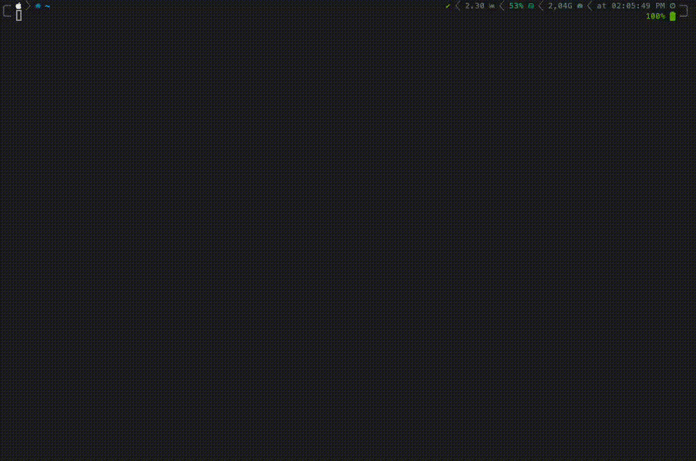

# Orbit Bootstrap

> Framework AWS-first para [Kiro](https://kiro.dev) que detecta tu tipo de proyecto, valida e instala herramientas, carga agentes y skills por perfil, y deja el entorno listo para trabajar — en segundos.

[](https://github.com/eliecer2000/kiro-bootstrap/stargazers)
[](https://github.com/eliecer2000/kiro-bootstrap/network)
[](https://github.com/eliecer2000/kiro-bootstrap/commits/main)
[](https://github.com/eliecer2000/kiro-bootstrap/releases)

---



---

## Instalacion

```bash
curl -sL https://raw.githubusercontent.com/eliecer2000/kiro-bootstrap/main/install.sh | bash
```

Despues de instalar:

```bash
# Ver opciones disponibles
~/.kiro/orbit/install.sh --help

# Actualizar el framework
~/.kiro/orbit/install.sh --update

# Resincronizar un proyecto existente
~/.kiro/orbit/install.sh --resync-project .
```

## Como funciona

Orbit ejecuta un pipeline de 6 pasos cuando preparas un proyecto:

```
1. Session Gates         → Pregunta si deseas preparar el entorno
2. Detect/Select Profile → Detecta el perfil o lanza un wizard
3. Validate Environment  → Valida herramientas de sistema (git, node, python3, aws, terraform)
                           e intenta instalarlas si faltan
4. Load Artifacts        → Copia agentes, steering, skills y hooks del perfil a .kiro/
5. Install Tooling       → Instala devDependencies del proyecto (eslint, prettier, vitest, ruff, etc.)
6. Write Project State   → Escribe .kiro/.orbit-project.json con metadata del perfil
```

El perfil se resuelve con un wizard basado en 4 dimensiones:

| Dimension | Opciones |
|---|---|
| Workload | backend-api, backend-worker, infra, shared-lib, frontend-amplify |
| Runtime | typescript, javascript, python |
| Provisioner | cdk, terraform, amplify |
| Framework | react, vue, nuxt (solo frontend-amplify) |

## Perfiles disponibles

### Fase 1 (activos)

| Perfil | Workload | Runtime | Provisioner |
|---|---|---|---|
| `aws-backend-api-typescript` | API Backend | TypeScript | — |
| `aws-backend-api-python` | API Backend | Python | — |
| `aws-backend-api-javascript` | API Backend | JavaScript | — |
| `aws-backend-lambda-typescript` | Lambda Worker | TypeScript | — |
| `aws-backend-lambda-python` | Lambda Worker | Python | — |
| `aws-backend-lambda-javascript` | Lambda Worker | JavaScript | — |
| `aws-infra-cdk-typescript` | Infraestructura | TypeScript | CDK |
| `aws-infra-terraform` | Infraestructura | HCL | Terraform |
| `aws-shared-lib-typescript` | Shared Library | TypeScript | — |
| `aws-shared-lib-python` | Shared Library | Python | — |
| `aws-shared-lib-javascript` | Shared Library | JavaScript | — |

### Fase 2 (preparados, deshabilitados)

| Perfil | Framework |
|---|---|
| `aws-amplify-react` | React |
| `aws-amplify-vue` | Vue |
| `aws-amplify-nuxt` | Nuxt |

## Agentes

Orbit incluye 14 agentes especializados que se asignan segun el perfil del proyecto:

| Agente | Rol |
|---|---|
| `orbit` | Bootstrap, onboarding, resincronizacion y coordinacion |
| `aws-architect` | Arquitectura AWS, patrones serverless y decisiones de diseno |
| `aws-lambda-python` | Funciones Lambda con Python |
| `aws-lambda-typescript` | Funciones Lambda con TypeScript/JavaScript |
| `aws-api-integration` | Contratos API, eventos, auth e integraciones |
| `aws-cdk` | Infraestructura con AWS CDK |
| `aws-terraform` | Infraestructura con Terraform |
| `aws-iam-security` | IAM, secretos, cifrado y least privilege |
| `aws-data-dynamodb` | Modelado DynamoDB y access patterns |
| `aws-observability` | Logs, metricas, alarmas y trazas |
| `aws-test-quality` | Pruebas, quality gates y aceptacion tecnica |
| `aws-amplify-react` | Frontend Amplify + React (fase 2) |
| `aws-amplify-vue` | Frontend Amplify + Vue (fase 2) |
| `aws-amplify-nuxt` | Frontend Amplify + Nuxt (fase 2) |

## Skills

22 skills locales organizadas por dominio:

| Categoria | Skills |
|---|---|
| Runtime | `typescript-runtime`, `javascript-runtime`, `python-runtime` |
| Serverless | `aws-lambda-typescript`, `aws-lambda-python`, `aws-serverless` |
| API & Data | `aws-api`, `aws-dynamodb` |
| Infraestructura | `aws-cdk`, `aws-terraform`, `aws-ec2`, `aws-rds`, `aws-s3`, `aws-cloudfront` |
| Seguridad | `aws-security` |
| Operaciones | `aws-observability`, `aws-cost-operations`, `aws-diagrams` |
| Testing | `aws-testing` |
| Arquitectura | `aws-architecture` |
| Framework | `orbit-bootstrap`, `find-skills` |

`find-skills` es obligatoria en todos los perfiles — permite descubrir e instalar skills adicionales via `npx skills`.

## Estructura del repositorio

```
agents/          Definiciones JSON de cada agente
profiles/        Perfiles de proyecto (deteccion, tooling, validaciones, agentes, skills)
steering/        Packs de reglas por capa tecnica
skills/          Skills locales con documentacion completa
hooks/           Hooks automatizados por runtime (format, lint, test)
extensions/      Packs de extensiones de Kiro por perfil
lib/             Runtime: pipeline, sesion, catalogo, carga de artefactos, instalacion de tooling
validations/     Validacion y auto-instalacion de herramientas de sistema
docs/            Documentacion tecnica del framework
templates/       Plantillas de contexto para onboarding de proyectos
tests/           Suite de tests del framework
```

## Ejecucion desde Kiro

Cuando Orbit opera desde el chat de Kiro, ejecuta el pipeline real antes de cualquier scaffolding:

```bash
ORBIT_BOOTSTRAP_DECISION=yes \
ORBIT_HOME_DECISION=no \
ORBIT_PROJECT_PROFILE_ID=<profile-id> \
ORBIT_REMOTE_SKILL_DECISION=no \
~/.kiro/orbit/install.sh --resync-project "<ruta>"
```

Orbit resuelve el `profile-id` internamente a partir del wizard. No pide el ID crudo al usuario, ni credenciales AWS durante el bootstrap normal.

## Documentacion

- [Arquitectura](docs/architecture.md) — Componentes, catalogo declarativo y runtime
- [Flujo de Bootstrap](docs/bootstrap-flow.md) — Pipeline paso a paso
- [Matriz de Perfiles](docs/profile-matrix.md) — Detalle de cada perfil
- [Catalogo de Agentes](docs/agent-catalog.md) — Roles, responsabilidades y handoffs
- [Guia de Authoring](docs/authoring.md) — Como agregar agentes, skills, perfiles y steering

## Tests

```bash
bash tests/test-all.sh
```

## Contributing

See [CONTRIBUTING.md](CONTRIBUTING.md) for how to add profiles, agents, skills, and steering packs.

Please read our [Code of Conduct](CODE_OF_CONDUCT.md) before participating.

## Security

To report a vulnerability, see [SECURITY.md](SECURITY.md). Do not open public issues for security concerns.

## License

[MIT](LICENSE) — Eliezer Rangel
