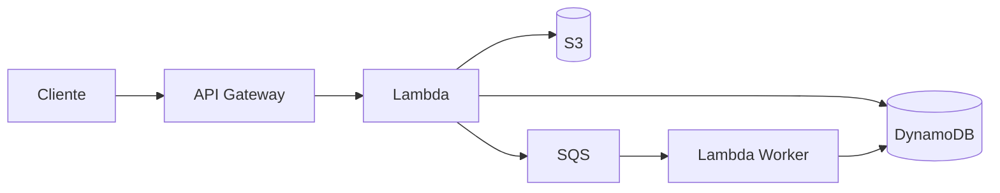
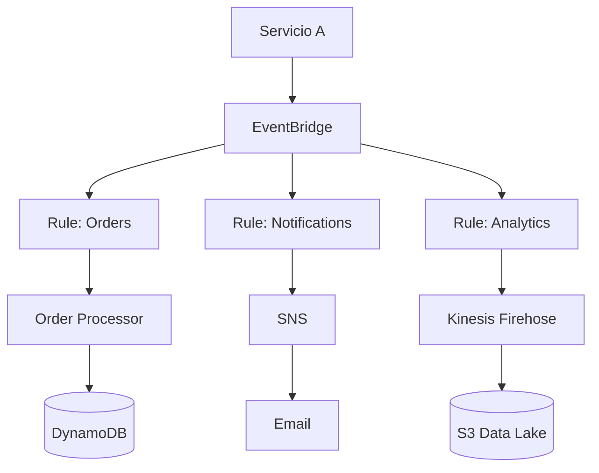
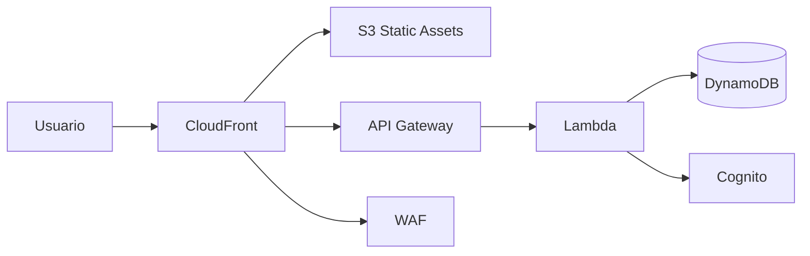
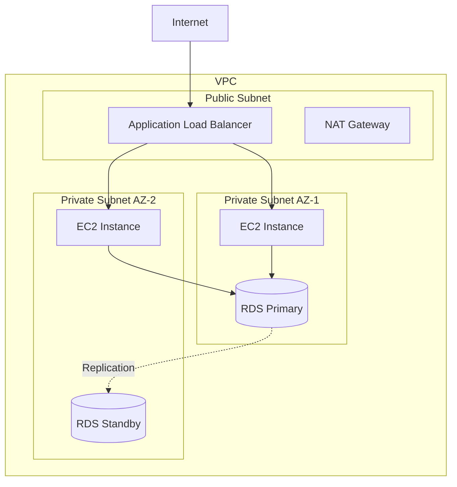

# AWS Diagrams

Skill para generar diagramas de arquitectura AWS desde CloudFormation, CDK, Terraform o descripciones en lenguaje natural. Usa notación C4, Eraser DSL o Mermaid para visualizar infraestructura.

## Principios fundamentales

- Todo sistema debe tener un diagrama de arquitectura actualizado.
- Preferir diagramas como código (Mermaid, Eraser DSL, PlantUML) sobre herramientas gráficas.
- Mostrar flujo de datos, no solo componentes. Las flechas indican dirección del tráfico.
- Agrupar por VPC, subnets y availability zones cuando aplique.
- Incluir servicios de seguridad (WAF, Security Groups) y observabilidad (X-Ray, CloudWatch).

## Patrones de diagrama Mermaid

### API Serverless típica


### Event-driven con EventBridge


### Full-stack con CloudFront


### Multi-AZ con RDS


## Eraser DSL para diagramas AWS

```eraser
main-vpc [label: "VPC 10.0.0.0/16"] {
  public-subnet [label: "Public Subnet"] {
    alb [icon: aws-elb, label: "ALB"]
    nat [icon: aws-vpc, label: "NAT Gateway"]
  }
  private-subnet [label: "Private Subnet"] {
    lambda [icon: aws-lambda, label: "API Handler"]
    ecs [icon: aws-ecs, label: "Worker Service"]
  }
  data-subnet [label: "Data Subnet"] {
    rds [icon: aws-rds, label: "PostgreSQL"]
    cache [icon: aws-elasticache, label: "Redis"]
  }
}

cloudfront [icon: aws-cloudfront, label: "CDN"]
s3 [icon: aws-s3, label: "Static Assets"]
cognito [icon: aws-cognito, label: "Auth"]
eventbridge [icon: aws-eventbridge, label: "Event Bus"]

cloudfront -> alb
cloudfront -> s3
alb -> lambda
lambda -> rds
lambda -> cache
lambda -> eventbridge
eventbridge -> ecs
```

## Convenciones de diagramas

### Colores por tipo de servicio
| Tipo | Color sugerido | Servicios |
|---|---|---|
| Compute | Naranja | Lambda, EC2, ECS, Fargate |
| Storage | Verde | S3, EBS, EFS |
| Database | Azul | DynamoDB, RDS, ElastiCache |
| Networking | Púrpura | VPC, CloudFront, API Gateway, Route 53 |
| Security | Rojo | IAM, WAF, Cognito, KMS |
| Integration | Rosa | SQS, SNS, EventBridge, Step Functions |

### Niveles de detalle (C4 Model)
1. **Context**: Sistema completo y actores externos.
2. **Container**: Servicios AWS principales y sus relaciones.
3. **Component**: Lambdas individuales, tablas, colas dentro de cada servicio.
4. **Code**: Solo cuando se necesita documentar lógica interna.

## Cuándo crear/actualizar diagramas

- Al diseñar una nueva feature o sistema.
- Al hacer cambios significativos en la arquitectura.
- En design reviews y RFCs.
- Al onboardear nuevos miembros del equipo.
- En documentación de runbooks y disaster recovery.

## Anti-patrones a evitar

- ❌ Diagramas desactualizados que no reflejan la arquitectura real.
- ❌ Diagramas sin flechas de dirección (no se entiende el flujo).
- ❌ Demasiado detalle en un solo diagrama (usar niveles C4).
- ❌ Diagramas solo en herramientas gráficas (no versionables en git).
- ❌ No incluir servicios de seguridad y observabilidad.
- ❌ Diagramas sin leyenda o convención de colores.

## Checklist de diagramas

- [ ] Diagrama de contexto (sistema + actores externos).
- [ ] Diagrama de containers (servicios AWS principales).
- [ ] Flechas con dirección y etiquetas de protocolo/acción.
- [ ] VPCs, subnets y AZs representados cuando aplica.
- [ ] Servicios de seguridad incluidos (WAF, IAM, Cognito).
- [ ] Diagrama como código (Mermaid, Eraser DSL, PlantUML).
- [ ] Versionado en git junto al código.
- [ ] Actualizado con cada cambio significativo de arquitectura.
